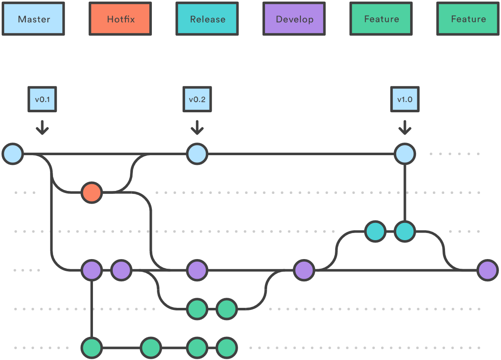

Branches in Git:

Branches in Git ermöglichen parallele Entwicklung. Hier sind die wichtigsten Befehle:

Branch erstellen:
git branch <branchname>

Zu einem Branch wechseln:
git checkout <branchname>

Branch erstellen und wechseln in einem Schritt:
git checkout -b <branchname>

Branch zusammenführen (Merge):
git merge <branchname>

Branch löschen:
git branch -d <branchname>

Grafische Tools bieten oft eine intuitivere Darstellung dieser Prozesse.
Hier ist eine einfache Darstellung:
